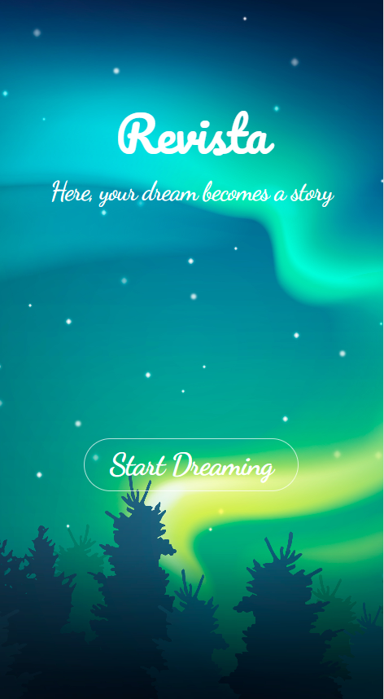
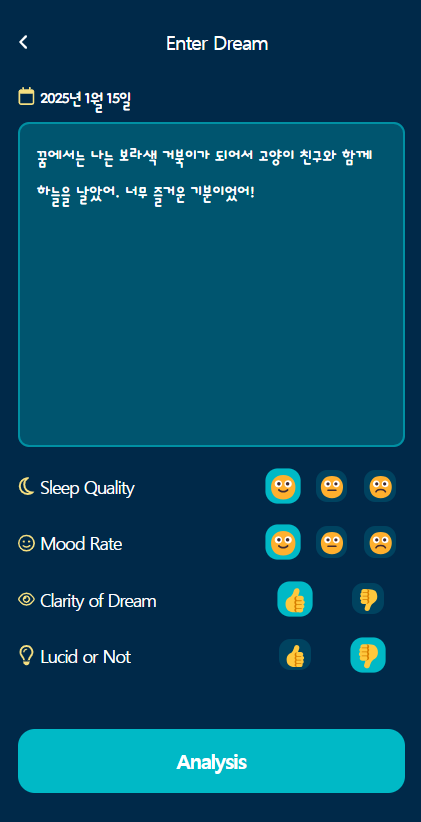
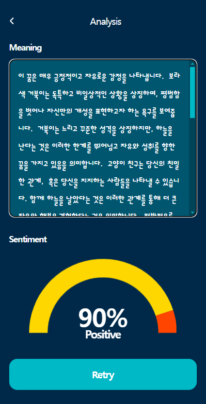

# 프로젝트명: Revista

### 꿈해몽앱👀

### 배포주소

레비스타 바로가기: <https://elena7993.github.io/revista/>

### 1. 앱 이미지

### 2. 목적

- 사용자가 꿈을 기록하고, 꿈의 테마와 감정을 분석하여 자기 이해를 돕는다.
- 꿈의 키워드를 기반으로 해몽과 테마를 제공하여 꿈의 의미를 자세히 해석한다.

### 3. 기능

1. 꿈 기록:
   사용자가 꿈의 내용을 입력하거나 키워드로 정리.
   감정(이모지 선택)과 테마(탭으로 선택) 추가 가능.

2. 꿈 분석: -입력된 꿈을 키워드로 분석해 테마와 감정을 그래프로 시각화.
   -AI 기반 해몽 기능 제공

### 4. 스택

- HTML, CSS, JavaScript, React, Google Gemini Api

### 5. 개발 스케줄

| 날짜     | 작업 내용                                                                                                |
| -------- | -------------------------------------------------------------------------------------------------------- |
| 금 22.11 | API 선정 프로젝트명 및 기획안 작성 레퍼런스 조사 및 디자인 작업 시작                               |
| 토 23.11 | 디자인 최종 수정 및 컨펌 코드 초기 세팅 및 깃허브 연동 기본 구성요소 세팅 API 연동 및 기능 구현 |
| 일 24.11 | 홈과 꿈 기록 페이지 구성                                                                                 |
| 월 25.11 | 꿈 분석 페이지 구성                                                                                      |
| 화 26.11 | 각 페이지들 코드 최종 수정 최종 테스트 유지 보수 및 배포 준비                                      |
| 수 27.11 | 배포                                                                                                     |

### **6. 작업하면서 느낀 점**

**(1)문제 발생과 해결을 위한 시도**

- Google Gemini API를 활용해 꿈 데이터를 분석하고, 사용자의 긍정적인 감정과 부정적인 감정을 차트로 시각화하려고 시도했다.
  그러나 차트가 동작하지 않는 문제가 발생했고, positive와 negative 값이 상태에 저장되어도 결과가 나타나지 않았다.
  문제를 해결하기 위해 **API 프롬프트(prompt)**를 더 구체적으로 작성하고, 감정 데이터를 보다 명확하게 반환하도록 수정했다.
  이러한 과정을 거친 후에야 SentimentGraph를 통해 데이터를 차트로 성공적으로 시각화할 수 있었다.

**(2)향후 계획과 총평**

- 차트를 다루는 과정이 생각보다 흥미로웠다. 데이터를 시각적으로 표현하는 방법에 대해 새로운 시각을 얻을 수 있었다.
  앞으로는 다양한 형태의 차트를 활용해 보고, 사용자와의 인터랙션이 가능한 동적인 차트도 구현해 보고 싶다.
- 이 프로젝트를 더 발전시킨다면 일기장처럼 꿈 기록장으로 하면 흥미로울 것 같다.
  꿈을 기록하고, 그 당시의 감정을 함께 저장하며, 이를 주별, 월별, 연간 데이터로 차트화해 시각적으로 확인할 수 있다면 유용하면서도 재미있는 기능이 될 것 같다. 이러한 확장은 단순한 기록을 넘어, 사용자에게 데이터 기반의 새로운 경험을 제공할 수 있을 것이라는 생각이 든다!😋
